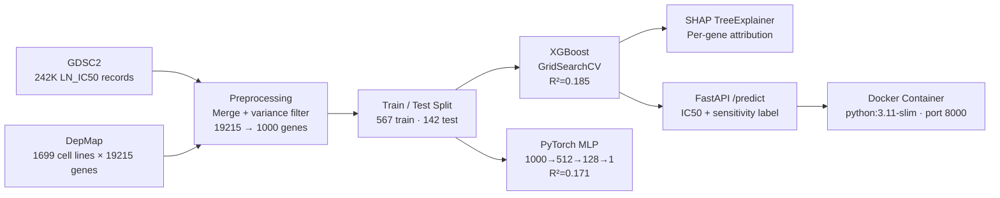

# Drug Response Prediction Platform

> Predicts cancer cell line sensitivity to targeted therapies from bulk gene expression profiles, producing LN_IC50 estimates and a binary sensitive/resistant classification via a containerized REST API.

**Built with:** Python, XGBoost, PyTorch, SHAP, FastAPI, Docker, scikit-learn, Pandas

---

## The Problem

Cancer drug response is highly variable: two tumors with the same diagnosis can have opposite sensitivities to the same compound, making empirical cell line screening expensive and slow. Researchers testing 286 drugs across hundreds of cell lines generate hundreds of thousands of measurements — but those measurements live in disconnected databases (GDSC for pharmacology, DepMap for genomics) that require nontrivial integration before any predictive modeling can begin. This platform automates that integration, builds predictive models from the merged dataset, and serves predictions through an API that accepts a gene expression vector and returns an IC50 estimate in milliseconds.

---

## What I Built

The platform covers the full arc from raw public data to a Dockerized prediction service. GDSC drug response data (242,036 records) is merged with DepMap expression profiles across matched cell lines, variance-filtered down to 1,000 informative genes, and used to train two competing models. SHAP identifies which genes drive predictions, and the winning model is packaged into a FastAPI service that validates input shape and returns both a continuous IC50 prediction and a sensitivity label.

- **Preprocessing pipeline** (`02_preprocessing.ipynb`): merges GDSC LN_IC50 with DepMap TPM expression across 712 matched cell lines; variance-based selection reduces 19,215 genes to 1,000; StandardScaler normalization; 80/20 stratified split
- **XGBoost model** (`03_xgboost_model.ipynb`): gradient-boosted regressor with 3-fold GridSearchCV over 27 hyperparameter combinations; best config: `learning_rate=0.1, max_depth=3, n_estimators=200`
- **PyTorch MLP** (`04_pytorch_model.ipynb`): three-layer network (1000→512→128→1) with ReLU activations, 0.3 dropout, Adam optimizer, trained for 100 epochs as a benchmark against XGBoost
- **SHAP interpretability** (`05_shap_interpretability.ipynb`): TreeExplainer over 142 test samples producing per-gene attribution scores; top gene IGFBP5 with mean |SHAP| of 0.132; top-20 genes exported to `reports/shap_top20_genes.csv`
- **FastAPI service** (`api/main.py`): `/predict` endpoint accepts 1,000 gene expression values, applies the saved scaler, runs the XGBoost model, and returns `predicted_ic50` + `sensitivity` label; `/health` exposes model load status
- **Docker image**: `python:3.11-slim` base with model artifacts and processed data baked in; single `docker run` command starts the service on port 8000

---

## Key Technical Decisions

**Why XGBoost as the production model instead of the PyTorch MLP?**
XGBoost achieved R²=0.1849 vs the MLP's 0.1707 on the held-out test set — a meaningful gap on a dataset of only 709 samples. More importantly, XGBoost is natively supported by SHAP's `TreeExplainer`, which computes exact Shapley values in one pass. The MLP's slightly better Pearson correlation (0.4947 vs 0.4391) is outweighed by the interpretability cost: SHAP gradient-based explanations for neural nets are approximations and substantially slower. For a domain where knowing *which* genes drive the prediction matters as much as the prediction itself, exact attribution is the right tradeoff.

**Why variance-based feature selection instead of PCA or learned embeddings?**
Reducing 19,215 genes to 1,000 by top variance retains gene identities in the feature matrix. SHAP values on the output of PCA components have no biological interpretation — you cannot tell a biologist that "PC17 contributed 0.08 to the IC50 estimate." Variance filtering preserves named genes (IGFBP5, TRPV2, CNN3, DUSP6, etc.) that can be directly cross-referenced against known oncology literature. The 95% dimensionality reduction also keeps training fast and the API payload manageable.

**Why LN_IC50 as the regression target rather than raw IC50?**
Raw IC50 values span several orders of magnitude across drugs and cell lines. Log-transforming produces a near-normal distribution (mean 2.76, std 1.41 in the training set), which makes MSE-minimizing gradient updates well-conditioned. The sensitivity threshold in the API (`LN_IC50 < 2`) maps cleanly back to a biologically interpretable nanomolar cutoff without any post-hoc rescaling.

**Why package model artifacts inside the Docker image rather than mounting a volume?**
The Dockerfile explicitly copies `models/`, `data/processed/` (scaler and gene list), and `api/` into the image. This makes the container fully self-contained: no external object store, no volume mount, no startup download. For a research tool where reproducibility matters and the artifacts are small (one `.joblib` file, two `.pkl` files), image-bundled artifacts eliminate an entire class of deployment failure.

**Why FastAPI with Pydantic input validation instead of a plain Flask endpoint?**
The `PredictionRequest` model enforces that `gene_expression` is a `list[float]` at deserialization time. The `/predict` handler then explicitly checks the vector length against the stored gene list and raises a 400 with the expected count if it mismatches. This catches the most common integration error — passing the wrong number of features — before it reaches the model, producing a clear error message rather than a silent wrong prediction.

---

## Results & Metrics

- 242,036 GDSC drug response records merged with 1,699-cell-line DepMap expression dataset → 712 matched cell lines with paired pharmacology + genomics
- Variance filtering: 19,215 genes → 1,000 features, reducing model training time and API payload size by 95%
- XGBoost (tuned): R²=0.1849, Pearson r=0.4391 on 142-sample held-out test set
- PyTorch MLP (baseline): R²=0.1707, Pearson r=0.4947
- XGBoost selected as production model: higher R², exact SHAP attribution, faster inference
- SHAP top gene: IGFBP5 (mean |SHAP| = 0.132), followed by TRPV2 and CNN3
- API input validation rejects wrong-length vectors with a 400 before model inference runs

---

## Architecture



---

## Stack

| Layer | Technology |
|---|---|
| ML / Modeling | XGBoost 2.1, PyTorch, scikit-learn |
| Interpretability | SHAP (TreeExplainer) |
| Data Processing | Pandas, NumPy, SciPy |
| API | FastAPI 0.115, Uvicorn, Pydantic |
| Infrastructure | Docker (python:3.11-slim) |
| Notebooks | Jupyter, Matplotlib, Seaborn |

---

## Setup

**Prerequisites:** Python 3.11+, Docker (optional)

```bash
git clone https://github.com/YOUR_USERNAME/drug-response-prediction.git
cd drug-response-prediction
python -m venv venv && source venv/bin/activate
pip install -r requirements.txt
```

Place raw data files in `data/raw/`:
- `GDSC2_fitted_dose_response_27Oct23.xlsx`
- `OmicsExpressionTPMLogp1HumanProteinCodingGenes.csv`
- `Model.csv`

Run notebooks in order: `01` → `02` → `03` → `05`

```bash
# Run API locally (after running notebooks to generate model artifacts)
cd api && python main.py

# Or with Docker
docker build -t drug-response-api .
docker run -p 8000:8000 drug-response-api
```

```bash
# Example prediction request
curl -X POST "http://localhost:8000/predict" \
  -H "Content-Type: application/json" \
  -d '{"gene_expression": [0.5, 1.2, ...]}'  # 1000 float values
```

---

## Where This Fits

Cancer drug discovery moves from target identification through preclinical cell line screening before any compound reaches a patient. This platform operates at the cell line screening stage — learning from historical GDSC sensitivity measurements to predict response without running the assay.

```
Target ID → Hit Discovery → Cell Line Screening → Lead Optimization → Preclinical → Clinical
                                      ↑
                          this platform predicts here
```

---

## Production Considerations

- **Data leakage audit:** The current split is random across cell lines. A production deployment would split by cancer type or tissue of origin to test generalization to unseen tumor lineages, not just unseen samples from the same distribution.
- **Multi-drug support:** The preprocessing notebook selects one drug (Ulixertinib) for modeling. The architecture supports any of the 286 GDSC drugs with a pipeline parameter change; production would train and version a model per compound.
- **Model drift monitoring:** Gene expression platforms evolve. A model trained on GDSC2 TPM profiles will require revalidation if input expression comes from a different normalization pipeline or sequencing protocol.
- **Batch inference:** The current API handles single-sample requests. Cell line panels are typically scored in batches of dozens to hundreds; a `/predict_batch` endpoint with numpy vectorized inference would be needed for throughput.
- **Uncertainty quantification:** IC50 predictions without confidence intervals are difficult to act on clinically. XGBoost supports quantile regression; adding prediction intervals would make the output more useful for prioritization decisions.
